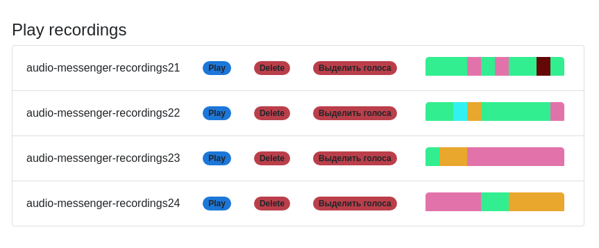

# deepvk-test-task

Репозиторий с решением тестового задания для стажировки в команде Прикладных Исследований Вконтакте

## Задание

Реализовать статью, оценить результаты, составить отчёт по исследованию в отдельной Jupyter тетрадке. Я выбрал [cтатью](https://arxiv.org/pdf/1905.11786v2.pdf) с unsupervised обучением аудиоэмбеддингов. Отчёт находится в report.ipynb, реализация модели - GIL_model/, более ранняя модель, на которую опирались авторы - CPC_model/

## Демка распознавания спикеров

Сделана второпях в последний момент, но вполне годно работает. Для запуска:

### Поднять бэк

`pip3 install flask_cors`

`python3 web_demo_server.py`

Модель по дефолту переносится на видеокарту cuda:0, поменять девайс можно в `templates/config_classifier.yaml`

### Поднять фронт

За основу фронта взят чужой проект, дающий возможность записать, послушать и отправить свой (и не только!) голос, потому не было времени писать фронт самому

В demo_frontend:

`npm install`

`gulp dev`

